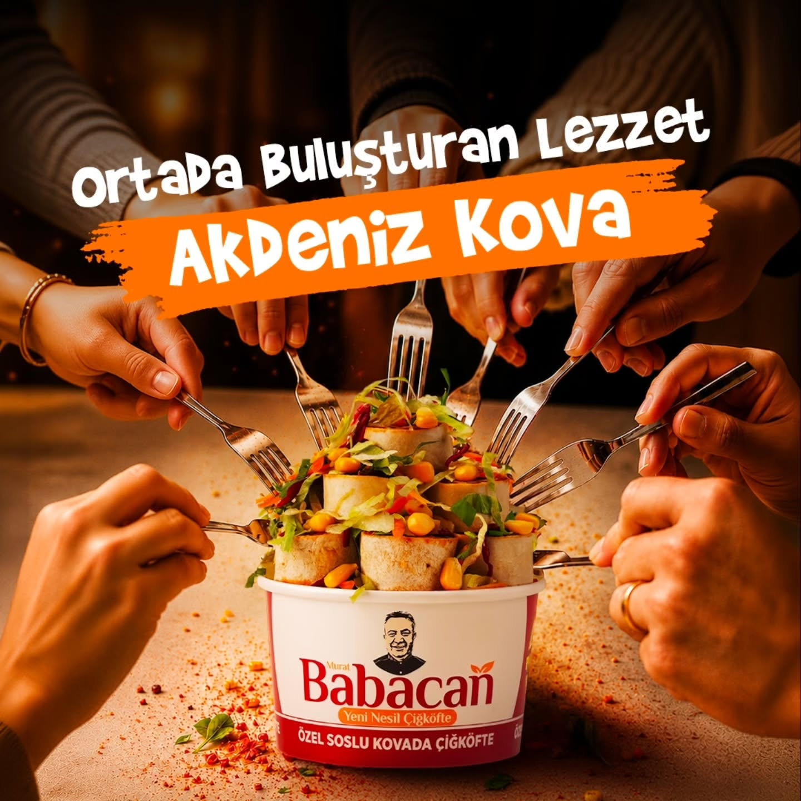

# Babacan Çiğköfte Küçükpark — Restaurant Website

**Light, editorial-style, mobile-first website for Babacan Çiğköfte's Küçükpark branch in Bornova, İzmir.**


**Live:** [babacan-kucukpark.vercel.app](https://babacan-kucukpark.vercel.app)

Client project — designed and developed by Berke Coşkuner for Babacan Çiğköfte Küçükpark.

<p align="center">
  
</p>

## Overview

A one-page restaurant website that helps visitors see the menu, find the branch and order by phone with one tap. All content uses the branch's own product and in-store photos, and every business detail (menu, opening hours, phone, Instagram, map link) comes from one data file.

## Features

- **Hero** with "call to order" and "explore flavours" actions
- **Info strip** — location, opening hours (10:30 – 00:30) and click-to-call phone number
- **Flavours / menu** — product cards with category filter: buckets (kova), restaurant plates, portion & weight options
- **About** section and **photo gallery** with a lightbox
- **Contact** — Google Maps link, Instagram, phone
- **Mobile bottom bar** — sticky call and directions buttons on phones
- **SEO** — metadata, `Restaurant` Schema.org JSON-LD (address, cuisine, opening hours), `sitemap.xml`, `robots.txt`, web app manifest
- Optimised images (AVIF / WebP) and self-hosted Google Fonts (Playfair Display, Plus Jakarta Sans)

## Design

| Token | Colour |
| --- | --- |
| Background | `#FBF8F2` warm off-white |
| Cards | `#FFFFFF` |
| Highlight sections | `#F1E9DD` light beige |
| Primary accent (CTA) | `#A92B25` pepper red |
| Secondary accent | `#66734A` olive green |
| Text | `#29231F` warm dark brown |

Typography: *Playfair Display* for headings (with Turkish character support), *Plus Jakarta Sans* for body text.

## Tech stack

| Area | Technology |
| --- | --- |
| Framework | Next.js 14 (App Router), React 18 |
| Language | TypeScript |
| Styling | Tailwind CSS 3, clsx, tailwind-merge |
| Icons | lucide-react |
| Hosting | Vercel |

## Project structure

```
babacan/
├── public/images/          # branch product and in-store photos
├── src/
│   ├── app/                # layout (metadata + JSON-LD), page, sitemap, robots, manifest, icon
│   ├── components/         # Header, Hero, InfoStrip, FlavorsSection, AboutSection,
│   │                       # GallerySection, Lightbox, ContactSection, Footer, MobileBottomBar
│   └── data/restaurant.ts  # single source for all business info and the menu
├── next.config.mjs
└── tailwind.config.ts
```

## Getting started

Requirements: Node.js 18+ (20 or 24 recommended) and npm.

```bash
npm install
npm run dev      # http://localhost:3000
npm run build
npm run start
npm run lint
```

### Updating business information

Edit **`src/data/restaurant.ts`**. Header, hero, menu, gallery, contact, footer, mobile bar and the JSON-LD schema all update automatically.

### Environment variables

| Name | Purpose |
| --- | --- |
| `NEXT_PUBLIC_SITE_URL` | Optional. Canonical URL for metadata and sitemap (falls back to the Vercel URL). |

## Deployment

The site needs no database and no server secrets. On Vercel: import the repository, keep the auto-detected **Next.js** preset (`next build`, output `.next`), optionally set `NEXT_PUBLIC_SITE_URL` for a custom domain, and deploy.

---

## Türkçe

**Babacan Çiğköfte Küçükpark** (Bornova, İzmir) şubesi için hazırlanmış açık temalı, editoryal tarzda ve mobil öncelikli restoran web sitesi.

**Canlı:** [babacan-kucukpark.vercel.app](https://babacan-kucukpark.vercel.app)

Müşteri projesi — Berke Coşkuner tarafından Babacan Çiğköfte Küçükpark için tasarlanıp geliştirilmiştir.

### Genel bakış

Ziyaretçilerin menüyü görmesini, şubeyi bulmasını ve tek dokunuşla telefonla sipariş vermesini sağlayan tek sayfalık restoran sitesi. Sitede şubeye ait ürün ve mekân fotoğrafları kullanılır; menü, çalışma saatleri, telefon, Instagram ve harita bağlantısı gibi tüm bilgiler tek bir veri dosyasından gelir.

### Özellikler

- **Hero** — "Sipariş İçin Ara" ve "Lezzetleri Keşfet" butonları
- **Bilgi şeridi** — konum, çalışma saatleri (10:30 – 00:30), tıkla-ara telefon
- **Lezzetler / menü** — kategori filtreli ürün kartları: kovalar, restoran sunumları, porsiyon & kilo
- **Hakkımızda** ve lightbox'lı **fotoğraf galerisi**
- **İletişim** — Google Maps, Instagram, telefon
- **Mobil alt bar** — telefonda sabit "ara" ve "yol tarifi" butonları
- **SEO** — metadata, `Restaurant` JSON-LD (adres, mutfak, çalışma saatleri), sitemap, robots, web app manifest

### Kurulum

```bash
npm install
npm run dev      # http://localhost:3000
npm run build
```

İşletme bilgilerini güncellemek için yalnızca **`src/data/restaurant.ts`** dosyasını düzenleyin. İsteğe bağlı ortam değişkeni: `NEXT_PUBLIC_SITE_URL`.

### Yayınlama

Veritabanı veya sunucu sırrı gerekmez. Vercel'de depoyu içe aktarın, otomatik algılanan **Next.js** ayarlarıyla yayınlayın; özel alan adı için `NEXT_PUBLIC_SITE_URL` tanımlayın.

---

Built by [Berke Coşkuner](https://github.com/CoskunerBerke)
